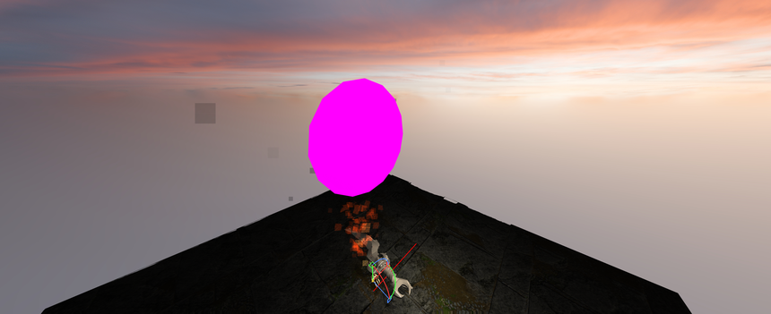
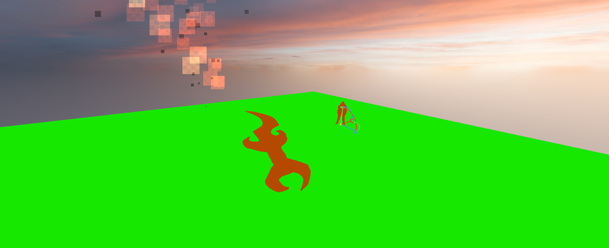
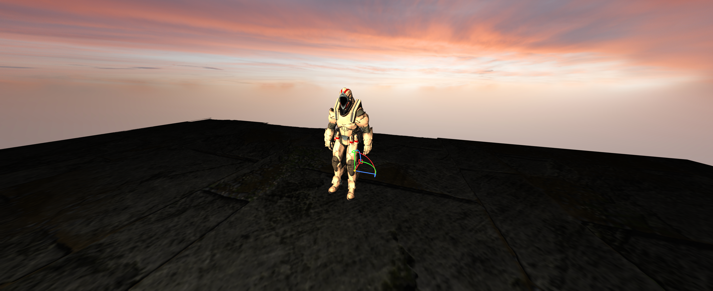
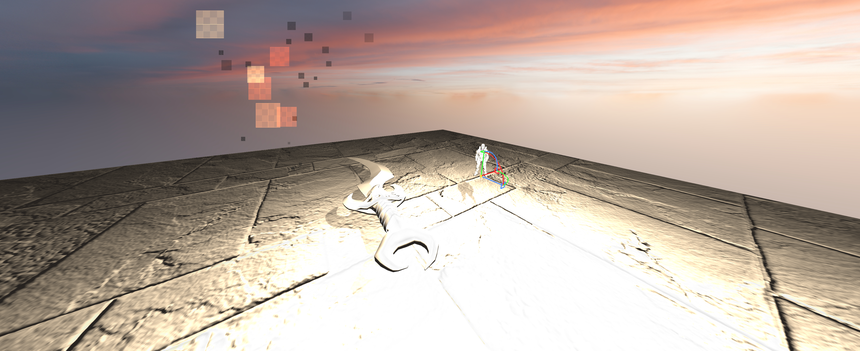
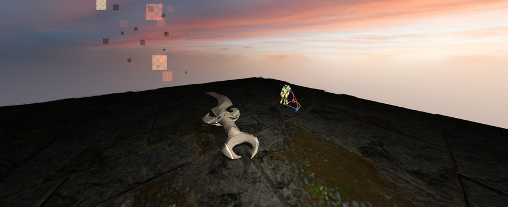
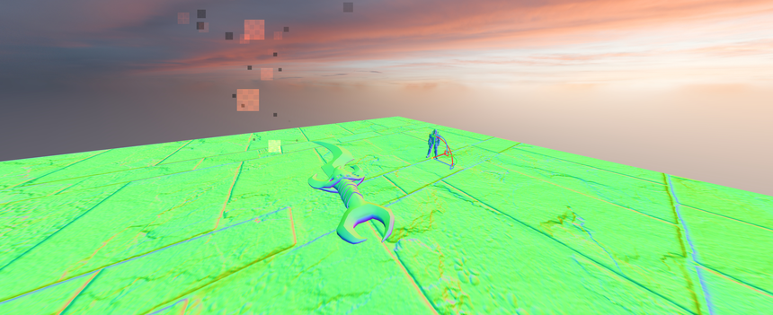
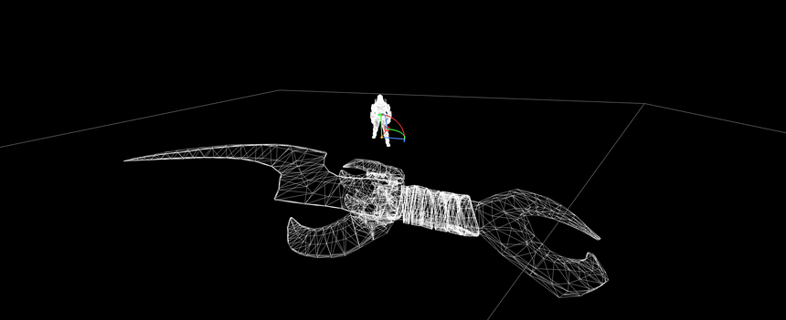
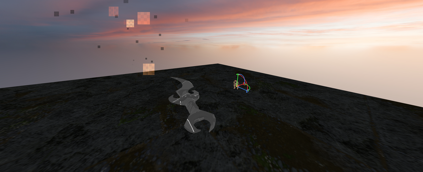
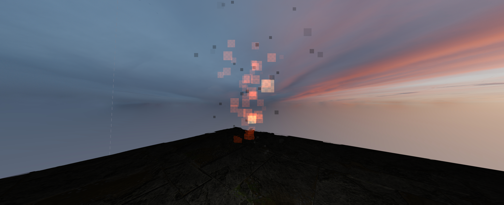

# Horizon Rendering Library


> \\\*\\\*Version\\\*\\\* `26.6` — A lightweight, explicit rendering abstraction layer.

HRL is a C/C++ rendering library designed to sit on top of multiple graphics backends (OpenGL, Vulkan, D3D11/12, Metal, and more) behind a unified, stable API. It is built around a simple principle: **nothing exists until you create it, and everything you create must be explicitly destroyed.**

\---

## Showcase

A few screenshots showcasing HRL's rendering and debug capabilities:

|Debug shape|Density|Gizmo|
|-|-|-|
||||

|Lightning|Lit|Normal|
|-|-|-|
||||

|Wireframe|Unlit|VFX|
|-|-|-|
||||

# Full Documentation

[Official Site](https://oscar-soirey.github.io/Horizon-Rendering-Library)

\---

# Credits

### Structure, OpenGL \& Vulkan backend

* Oscar Soirey
* contact : oscarsoirey.contact@gmail.com

### DirectX 11 backend

* [@CodeBYMehdi](https://github.com/CodeBYMehdi)
* contact : mehdibjjj@gmail.com

\---

## Table of Contents

* [Supported Backends](#supported-backends)
* [Core Philosophy — Explicit Object Model](#core-philosophy--explicit-object-model)
* [Lifecycle](#lifecycle)
* [Object Overview](#object-overview)
* [Key Functions](#key-functions)

  * [Initialization](#initialization)
  * [Scenes](#scenes)
  * [Meshes \& Sprites](#meshes--sprites)
  * [Materials \& Shaders](#materials--shaders)
  * [Textures \& Fonts](#textures--fonts)
  * [Lights](#lights)
  * [Camera \& Viewports](#camera--viewports)
  * [Error Handling](#error-handling)
  * [Debug Utilities](#debug-utilities)
* [Minimal Example](#minimal-example)

\---

## Supported Backends

|Constant|Backend|Platform|
|-|-|-|
|`HRL_OpenGL33`|OpenGL 3.3|Windows, Linux, MacOS|
|`HRL_OpenGL45`|OpenGL 4.5|Windows, Linux, MacOS|
|`HRL_Vulkan`|Vulkan|Windows, Linux|
|`HRL_D3D11`|Direct3D 11|Windows, Xbox|
|`HRL_D3D12`|Direct3D 12|Windows, Xbox|
|`HRL_Metal`|Metal|Apple|
|`HRL_NVN`|NVN|Nintedo|
|`HRL_GNM`|GNM|Playstation|

\---

# Comparaison des backends graphiques

|Fonctionnalité|OpenGL 3.3|Vulkan|Direct3D 11|Direct3D 12|Metal|
|-|:-:|:-:|:-:|:-:|:-:|
|Initialisation / contexte|✅|✅|✅|✅|✅|
|Swapchain / présentation|—|✅|✅|✅|✅|
|Mesh 3D|✅|✅|✅|✅|✅|
|Mesh indexé|✅|✅|✅|✅|✅|
|Sprite|✅|✅|✅|✅|✅|
|Skeletal mesh|✅|✅|✅|✅|✅|
|LOD|✅|✅|✅|✅|✅|
|Textures|✅|✅|✅|✅|✅|
|Filtrage texture|✅|✅|✅|✅|✅|
|Matériaux PBR|✅|✅|✅|✅|✅|
|Albedo|✅|✅|✅|✅|✅|
|Normal map|✅|✅|✅|✅|✅|
|Metallic / Roughness|✅|✅|✅|✅|✅|
|Specular|✅|✅|✅|✅|✅|
|Alpha|✅|✅|✅|✅|✅|
|Lights point / directional / spot|✅|✅|✅|✅|✅|
|Sky light|✅|✅|✅|✅|✅|
|Fog classique|✅|✅|✅|✅|✅|
|MSAA / antialiasing|✅|✅|✅|✅|✅|
|Color picking|✅|✅|✅|✅|✅|
|Debug rendering|✅|✅|✅|✅|✅|
|Debug views|✅|⚠️ Partiel|⚠️ Partiel|⚠️ Partiel|⚠️ Partiel|
|Screenshot|✅|✅|✅|✅|✅|
|Post-processing|✅|❌|❌|❌|❌|
|Ambient Occlusion|✅|❌|❌|❌|❌|
|God Rays|✅|❌|❌|❌|❌|
|Sky Sphere|✅|❌|❌|❌|❌|
|Environment mapping|✅|❌|❌|❌|❌|
|Ombres des lights|✅|❌|❌|❌|❌|
|Volumetric fog|✅|❌|❌|❌|❌|
|Global volumetric fog|✅|❌|❌|❌|❌|
|GI / DDGI|✅|❌|❌|❌|❌|
|SSGI|API seulement|❌|❌|❌|❌|
|VCT|API seulement|❌|❌|❌|❌|
|LPV|API seulement|❌|❌|❌|❌|
|Path tracing|API seulement|❌|❌|❌|❌|
|Ray tracing|❌|✅|❌|✅|✅|
|VFX / particules|✅|✅/⚠️|✅/⚠️|✅/⚠️|✅/⚠️|
|VFX mesh particles|✅|✅|✅|✅|✅|
|Widgets|✅|✅|✅|✅|✅|
|Gizmos|✅|⚠️|⚠️|⚠️|⚠️|
|Post-process materials|✅|❌|❌|❌|❌|
|Async texture/shader|CPU/API|✅|⚠️|✅|✅|
|FBX|✅|✅|✅|✅|✅|
|Screen Space Displacement map|✅|✅|✅|✅|✅|
|Virtualized Geomtry|❌|✅|❌|✅|✅|

## Légende

* ✅ —
* ⚠️ —
* ❌ —


\---

## Core Philosophy — Explicit Object Model

HRL does **not** manage object lifetimes on your behalf. Every object — scene, mesh, texture, shader, material, light, camera, viewport, font — must be explicitly created before use and explicitly destroyed when no longer needed.

**If you did not call the `HRL_Create\\\*` function for an object, that object does not exist.** There are no implicit defaults loaded in the background, no hidden allocations, and no garbage collection. This design gives you full, deterministic control over GPU memory and render state.

The consequences of this model are straightforward:

* A mesh without a material assigned will not render correctly.
* A viewport without a camera assigned will not render.
* A material without a shader is invalid.
* A scene with no camera produces no output.

Every `HRL_Create\\\*` function returns an `HRL_id`. Always check that the returned value is **not** `HRL_INVALID_ID` before using it.

\---

## Lifecycle

A standard HRL application follows this structure:

```c
HRL_Init(backend)
HRL_InitContext(width, height, loader)
│
├── Create scenes, cameras, viewports
├── Create shaders, materials, textures
├── Create meshes and assign materials
├── Create lights
│
└── Main loop:
    ├── HRL_BeginFrame()
    ├── \\\[ update object transforms, uniforms, etc. ]
    ├── HRL_EndFrame()
    └── \\\[ swap buffers via your windowing layer ]

HRL_Shutdown() (clean every objects automatically)
```

\---

## Object Overview

|Object|Created by|Depends on|
|-|-|-|
|Scene|`HRL_CreateScene`|—|
|Camera|`HRL_CreateCamera`|Scene|
|Viewport|`HRL_CreateViewport`|Scene, Camera|
|Shader|`HRL_CreateShader`|—|
|Material|`HRL_CreateMaterial`|Shader|
|Texture|`HRL_CreateTexture`|—|
|Font|`HRL_CreateFont`|—|
|Mesh|`HRL_CreateMesh`|Scene, Material|
|Sprite|`HRL_CreateMeshSprite`|Scene, Material|
|Light|`HRL_CreateLight`|Scene|
|Post Process|`HRL_CreatePostProcess`|Scene, Material|

\---

## Key Functions

### Initialization

```c
HRL_Init(HRL_uint api);
```

Selects the graphics backend. Must be called first, before any other function.

```c
HRL_InitContext(HRL_uint width, HRL_uint height, void\\\* loader);
```

Creates the rendering context. `loader` is your platform's function loader (e.g. `glfwGetProcAddress` for OpenGL).

```c
HRL_Shutdown();
```

Releases all internal resources. Call before closing the window.

\---

### Scenes

A **scene** is the top-level container for all renderable objects, lights, and cameras. You need at least one scene to render anything.

```c
HRL_id HRL_CreateScene(int renderOnScreen);
```

Pass `HRL_True` to render directly to the screen, or `HRL_False` to render into an off-screen texture (useful for render-to-texture, post-processing pipelines, etc.). Off-screen scenes default to 480×480; use `HRL_ResizeSceneTexture` to change this.

```c
void HRL_DeleteScene(HRL_id sceneid);
```

\---

### Meshes \& Sprites

```c
HRL_id HRL_CreateMesh(HRL_id sceneid, HRL_uint type, float\\\* vertices);
HRL_id HRL_CreateMeshFromFile(HRL_id sceneid, HRL_uint type, const char\\\* data, size_t size);
HRL_id HRL_CreateMeshSprite(HRL_id sceneid);
```

`type` is one of `HRL_2D_Mesh`, `HRL_3D_Mesh`, or `HRL_3D_SkeletalMesh`. File loading supports `.fbx` and `.obj` formats.

Once created, a mesh must have a material assigned before it will render:

```c
void HRL_SetMeshMaterial(HRL_id meshid, HRL_id matid);
```

Transform functions:

```c
void HRL_SetMeshLocation(HRL_id meshid, float x, float y, float z);
void HRL_SetMeshRotation(HRL_id meshid, float pitch, float yaw, float roll);
void HRL_SetMeshScale(HRL_id meshid, float x, float y, float z);
```

\---

### Materials \& Shaders

A **shader** is a compiled GPU program. A **material** is an instance of a shader with specific uniform values bound to it. The same shader can back many different materials.

```c
HRL_id HRL_CreateShader(const char\\\* vertSrc, size_t vertSize, const char\\\* fragSrc, size_t fragSize);
HRL_id HRL_CreateMaterial(HRL_id shaderid);
```

Setting uniforms on a material:

```c
void HRL_MaterialSetFloat(HRL_id matid, const char\\\* name, float value);
void HRL_MaterialSetVec3(HRL_id matid, const char\\\* name, float x, float y, float z);
void HRL_MaterialSetTexture(HRL_id matid, const char\\\* name, HRL_id textureid);
// Also available: SetInt, SetBool, SetVec2, SetVec4
```

HRL provides built-in default shaders for common cases: `HRL_SpriteShader`, `HRL_Mesh2DShader`, `HRL_Mesh3DShader`, `HRL_DebugShader`.

\---

### Textures \& Fonts

```c
HRL_id HRL_CreateTexture(const char\\\* data, size_t size);
```

Accepted formats: `png`, `jpeg`, `bmp`, `tga`, `gif` (first frame), `hdr`, `psd` (partial). Data must be the raw file contents read in binary mode.

```c
HRL_id HRL_CreateTextureFromText(const char\\\* text, HRL_id fontid,
    float fontSize, float wrapWidth,
    float r, float g, float b,
    float bg_r, float bg_g, float bg_b, float bg_a);
```

Rasterizes a UTF-8 string into a GPU texture. Pass `wrapWidth = 0` to disable line wrapping. Set `bg_a = 0` for a transparent background.

```c
HRL_id HRL_CreateFont(const char\\\* data, size_t size);
```

Loads a TrueType font (`.ttf`) from a memory buffer. Required before calling `HRL_CreateTextureFromText`.

\---

### Lights

```c
HRL_id HRL_CreateLight(HRL_id sceneid, HRL_uint type);
```

`type` is one of `HRL_PointLight`, `HRL_DirectionalLight`, or `HRL_SpotLight`.

```c
void HRL_SetLightColor(HRL_id lightid, float r, float g, float b);
void HRL_SetLightIntensity(HRL_id lightid, float intensity);
void HRL_SetLightAttenuation(HRL_id lightid, float attenuation);
void HRL_SetLightLocation(HRL_id lightid, float x, float y, float z);
void HRL_SetLightRotation(HRL_id lightid, float pitch, float yaw, float roll);
```

\---

### Camera \& Viewports

A **camera** defines the point of view. A **viewport** maps a camera's output to a rectangular region of the screen. You need both to see anything rendered.

```c
HRL_id HRL_CreateCamera(HRL_id sceneid, HRL_uint type);  // HRL_Ortho or HRL_Perspective
void HRL_SetCameraPosition(HRL_id camid, float x, float y, float z);
void HRL_SetCameraRotation(HRL_id camid, float pitch, float yaw, float roll);
void HRL_SetCameraPerspectiveFov(HRL_id camid, float fov);    // degrees
void HRL_SetCameraOrthoVertical(HRL_id camid, float height);  // world units
```

```c
// Coordinates are normalized \\\[0..1]. (0,0) = top-left, (1,1) = bottom-right.
HRL_id HRL_CreateViewport(HRL_id sceneid, HRL_id cameraid, float x, float y, float w, float h);
```

Multiple viewports can be created for the same scene, enabling split-screen or picture-in-picture setups.

\---

### Error Handling

HRL records the last error internally. Query it after any operation that returns an `HRL_id` or may fail:

```c
HRL_Error HRL_GetLastError(const char\\\*\\\* detail, HRL_Severity\\\* severity);
```

For continuous monitoring, register a callback that will be invoked every time an error occurs:

```c
void HRL_RegisterErrorCallback(HRL_ErrorCallback callback);
// Signature: void callback(HRL_Error code, HRL_Severity severity, const char\\\* detail)
```

The convenience macro `HRL_CheckErrors()` prints any pending error to stdout, including the source file and line number. Suitable for debug builds.

Severity levels: `HRL_SEVERITY_WEAK_WARNING` · `HRL_SEVERITY_WARNING` · `HRL_SEVERITY_ERROR` · `HRL_SEVERITY_FATAL`

\---

### Debug Utilities

**Debug views** override scene rendering with a diagnostic mode:

```c
void HRL_DrawSceneAsDebugMode(HRL_id sceneid, HRL_uint mode);
// mode: HRL_DebugViewNone | HRL_DebugViewNormal | HRL_DebugViewLights
```

**Immediate-mode debug geometry** (must be called every frame to persist):

```c
void HRL_DrawDebugSegment(...);   // Line segment
void HRL_DrawDebugCircle(...);    // Circle (hollow or solid)
void HRL_DrawDebugCapsule(...);   // Capsule (hollow or solid)
void HRL_DrawDebugPolygon(...);   // Arbitrary polygon
void HRL_DrawDebugPoint(...);     // Screen-space point
```

**Screenshot:**

```c
void HRL_TakeScreenshot(HRL_id sceneid, const char\\\* path); // Saves as PNG
```

\---

## Minimal Example

```c
// 1. Initialize
HRL_Init(HRL_OpenGL45);
HRL_InitContext(1280, 720, glfwGetProcAddress);

// 2. Scene, camera, viewport
HRL_id scene    = HRL_CreateScene(HRL_True);
HRL_id camera   = HRL_CreateCamera(scene, HRL_Perspective);
HRL_id viewport = HRL_CreateViewport(scene, camera, 0.f, 0.f, 1.f, 1.f);
HRL_SetCameraPerspectiveFov(camera, 60.f);
HRL_SetCameraPosition(camera, 0.f, 0.f, -5.f);

// 3. Shader, material, texture
HRL_id shader   = HRL_CreateShader(vert_src, vert_len, frag_src, frag_len);
HRL_id material = HRL_CreateMaterial(shader);
HRL_id texture  = HRL_CreateTexture(png_data, png_size);
HRL_MaterialSetTexture(material, HRL_T_ALBEDO, texture);

// 4. Mesh
HRL_id mesh = HRL_CreateMeshFromFile(scene, HRL_3D_Mesh, obj_data, obj_size);
HRL_SetMeshMaterial(mesh, material);

// 5. Render loop
while (!glfwWindowShouldClose(window)) {
    HRL_BeginFrame();
    HRL_EndFrame();
    glfwSwapBuffers(window);
    glfwPollEvents();
}

// 6. Cleanup
HRL_Shutdown();
```

\---

*HRL is licensed under the Apache License 2.0. See* [*LICENSE*](http://www.apache.org/licenses/LICENSE-2.0) *for details.
Contact: oscarsoirey.contact@gmail.com*

